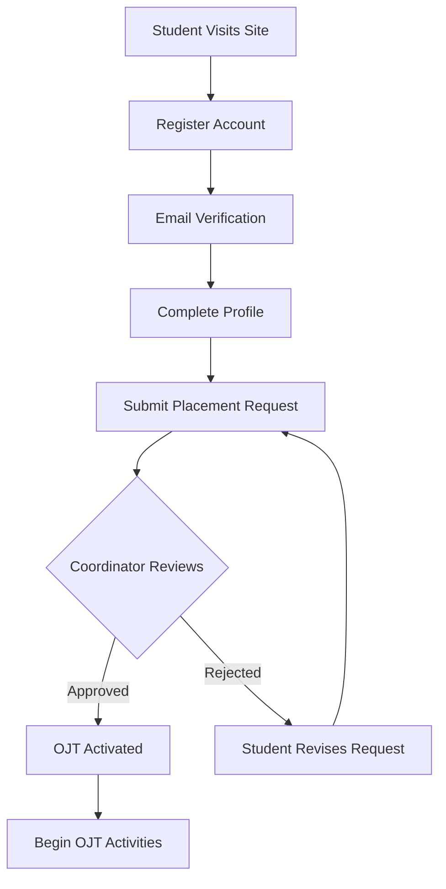
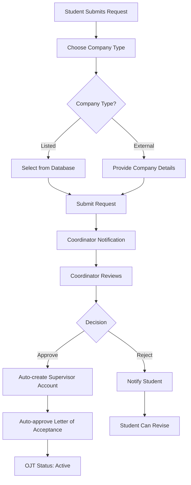
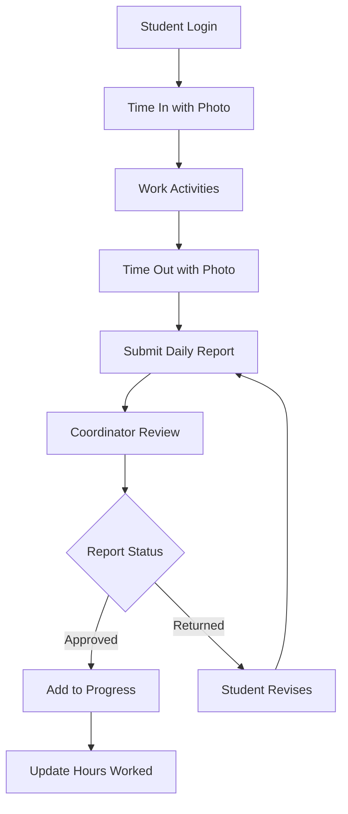
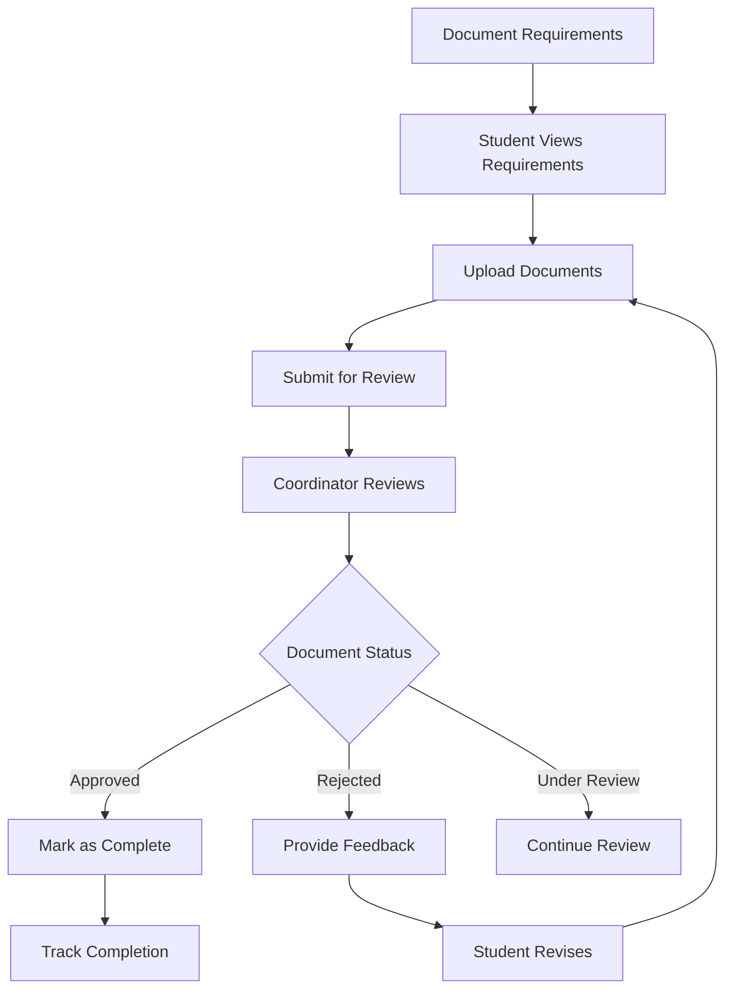
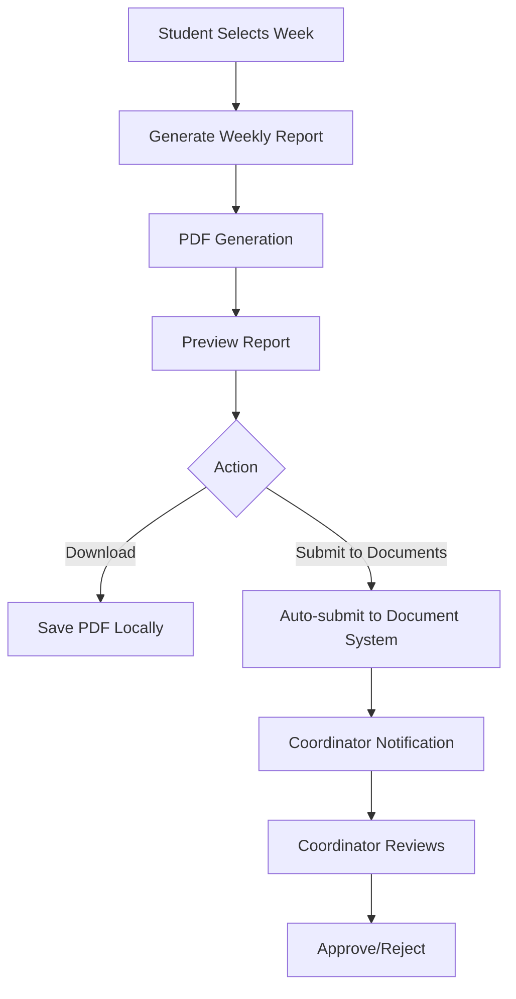
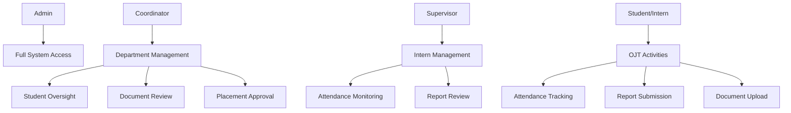
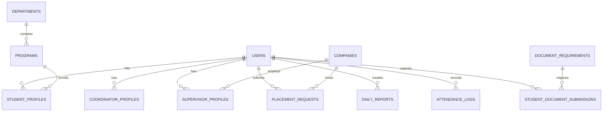
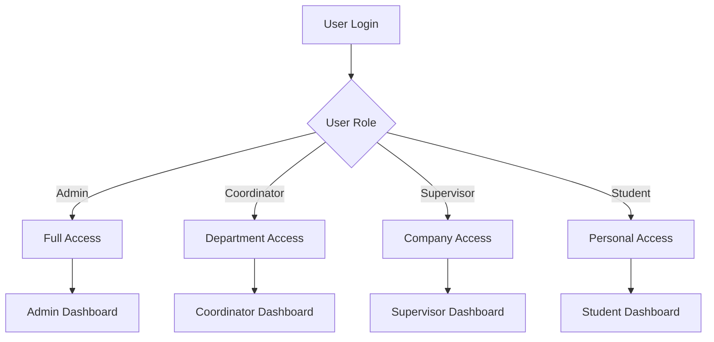
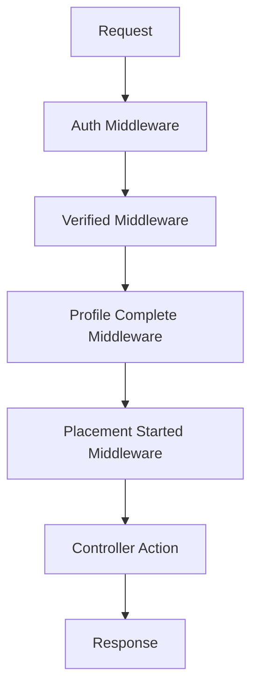
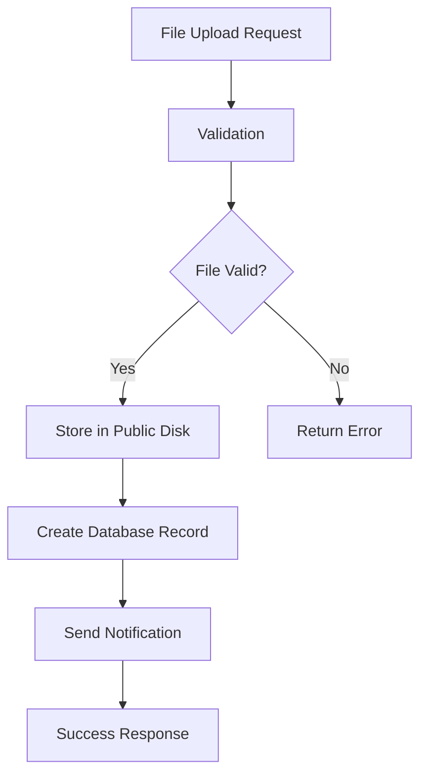

# OJT360 - Process Flow Documentation

## 🎯 Project Overview
**OJT360** is an end-to-end web-based internship monitoring and management system built with Laravel 9, designed to streamline the entire OJT process from student registration to completion.

---

## 📋 High-Level Process Flow

### 1. **System Initialization**
```
Admin Setup → Department Configuration → Program Setup → Document Requirements
```

### 2. **Student Onboarding Flow**
```
Student Registration → Email Verification → Profile Completion → Placement Request → Coordinator Review
```

### 3. **Placement Management Flow**
```
Placement Request → Coordinator Review → Approval/Rejection → Supervisor Assignment → OJT Activation
```

### 4. **OJT Execution Flow**
```
Daily Attendance → Daily Reports → Document Submissions → Weekly Reports → Progress Tracking
```

### 5. **Completion Flow**
```
Hours Completion → Final Document Review → Certificate Generation → Program Completion
```

---

## 🔄 Detailed Process Flows

### **A. Student Registration & Onboarding**



**Key Steps:**
1. **Registration**: Student creates account with email
2. **Verification**: Email verification required
3. **Profile**: Complete student profile (course, department, etc.)
4. **Placement**: Submit placement request with company choice
5. **Review**: Coordinator reviews and approves/rejects
6. **Activation**: Upon approval, OJT status becomes 'active'

### **B. Placement Request Management**



**Key Features:**
- **Company Types**: Listed companies vs External companies
- **Auto-creation**: Supervisor accounts created automatically
- **Auto-approval**: Letter of Acceptance approved with placement
- **Notifications**: Real-time notifications to all parties

### **C. Daily OJT Activities**



**Daily Activities:**
1. **Time In**: Photo capture with geolocation
2. **Work**: Student performs OJT activities
3. **Time Out**: Photo capture with geolocation
4. **Report**: Submit daily report with activities
5. **Review**: Coordinator reviews and provides feedback

### **D. Document Management Flow**



**Document Types:**
- **Pre-placement**: Letter of Acceptance, Medical Certificate
- **Post-placement**: Weekly Reports, Photo Documentation
- **Ongoing**: Attendance Records, Progress Reports

### **E. Weekly Report Generation**



**Features:**
- **PDF Generation**: Using DomPDF
- **Auto-submission**: Direct integration with document system
- **Preview**: Before final submission
- **Notifications**: Automatic coordinator notification

---

## 🏗️ System Architecture

### **User Roles & Permissions**



### **Database Relationships**



---

## 🔧 Technical Process Flows

### **Authentication & Authorization**



### **Middleware Flow**



**Middleware Chain:**
1. **Auth**: User must be logged in
2. **Verified**: Email must be verified
3. **Profile Complete**: Profile must be completed
4. **Placement Started**: OJT must be active (for students)

### **File Upload Process**



---

## 📊 Key Metrics & Tracking

### **Student Progress Tracking**
- **Hours Completed**: vs Required Hours
- **Reports Submitted**: Daily and Weekly
- **Documents Uploaded**: Required vs Submitted
- **Attendance Rate**: Time in/out consistency

### **Coordinator Dashboard Metrics**
- **Pending Placements**: Awaiting approval
- **Pending Reviews**: Documents and reports
- **Student Statistics**: By department and status
- **Completion Rates**: Program-wise statistics

### **System Performance Metrics**
- **Response Times**: API and page load times
- **Storage Usage**: File uploads and documents
- **User Activity**: Login patterns and usage
- **Error Rates**: System errors and exceptions

---

## 🔄 Integration Points

### **Email Notifications**
- **Registration**: Welcome emails
- **Placement**: Approval/rejection notifications
- **Document Review**: Status updates
- **Supervisor Creation**: Login credentials

### **File Management**
- **Storage**: Local public disk
- **Security**: File type validation
- **Backup**: Regular file backups
- **Cleanup**: Orphaned file removal

### **Reporting System**
- **Daily Reports**: Individual submissions
- **Weekly Reports**: Aggregated summaries
- **Progress Reports**: Completion tracking
- **Analytics**: System usage reports

---

## 🎯 Success Criteria

### **Student Success**
- ✅ Complete OJT requirements
- ✅ Submit all required documents
- ✅ Maintain good attendance
- ✅ Generate quality reports

### **Coordinator Success**
- ✅ Efficiently manage students
- ✅ Quick document reviews
- ✅ Effective communication
- ✅ Program oversight

### **System Success**
- ✅ High uptime and reliability
- ✅ Fast response times
- ✅ Secure data handling
- ✅ Scalable architecture

---

## 📈 Future Enhancements

### **Phase 2: Coordinator Module**
- Advanced analytics dashboard
- Bulk operations
- Report generation
- Communication tools

### **Phase 3: Supervisor Module**
- Intern management interface
- Attendance monitoring
- Performance tracking
- Feedback system

### **Phase 4: Admin Module**
- System-wide management
- Advanced reporting
- User management
- System configuration

---

**Last Updated**: Current Development Phase  
**Status**: Student Module Complete, Coordinator Module in Development  
**Next Phase**: Enhanced Coordinator Features
