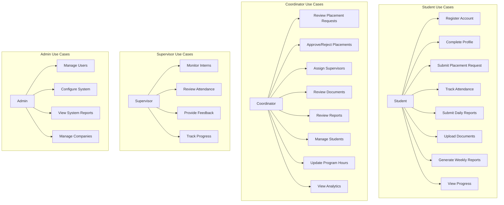
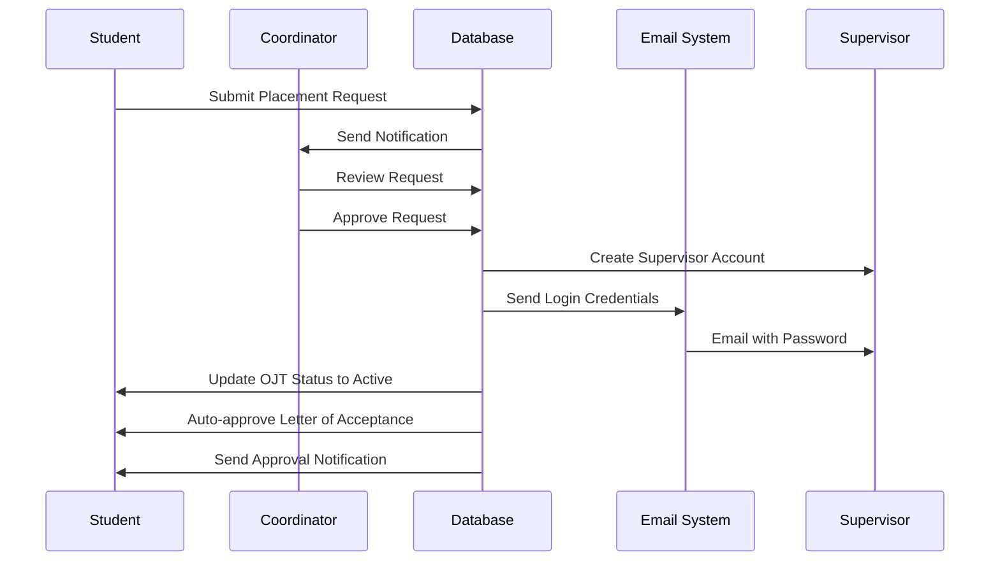
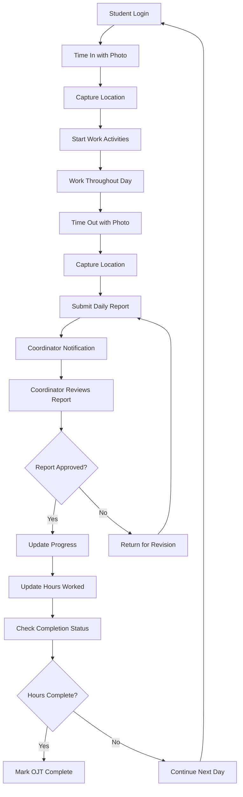
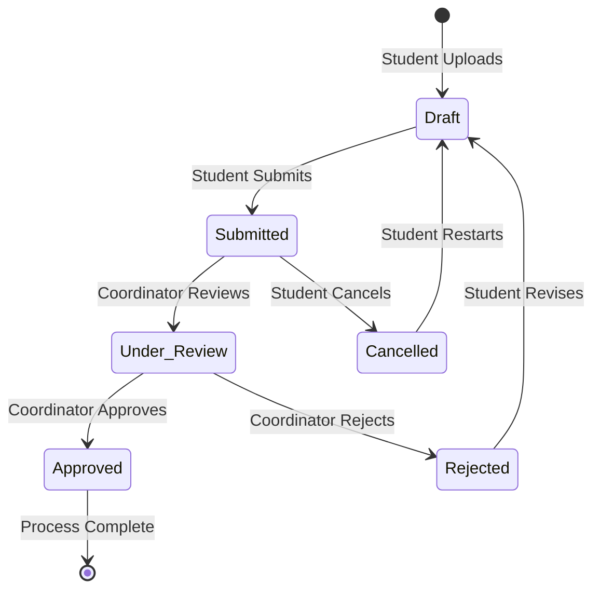
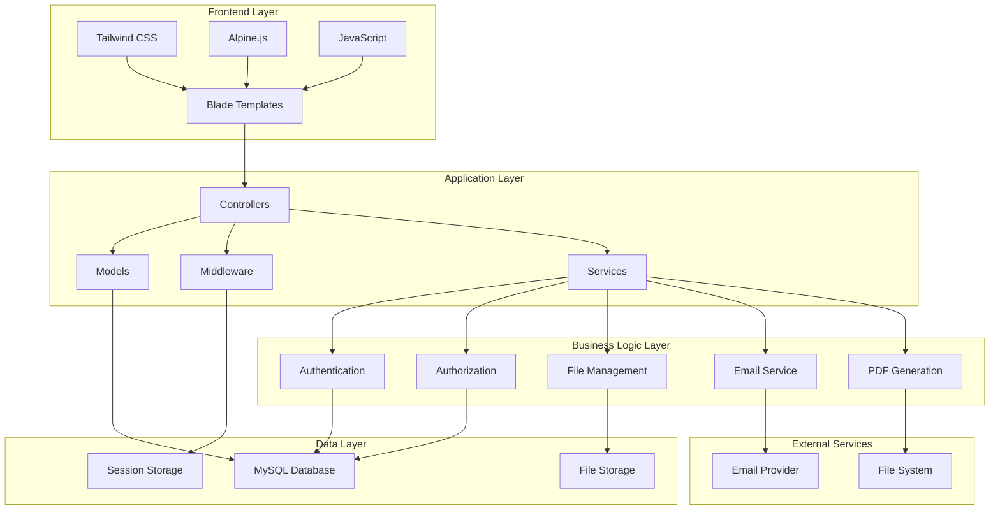
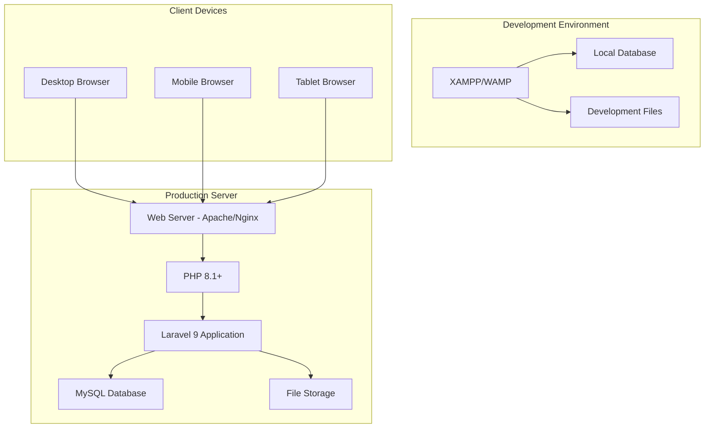
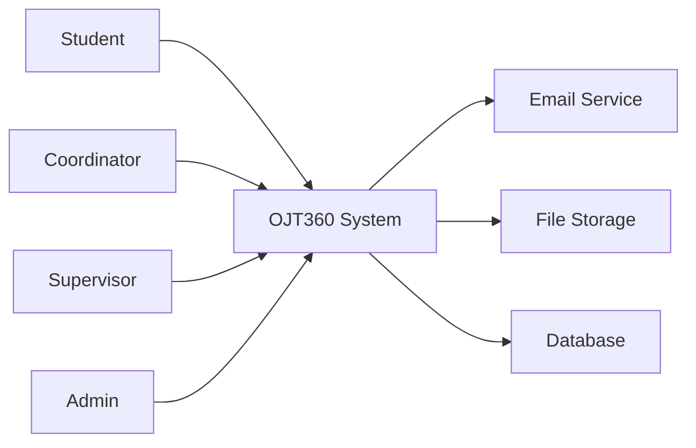
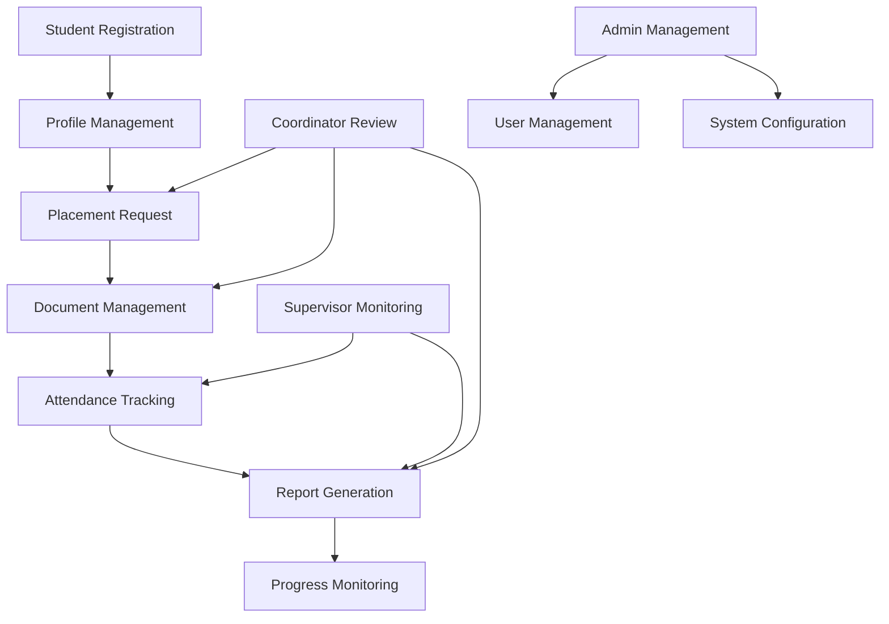

# OJT360 - UML Diagrams

## 🏗️ System Architecture UML

### **Class Diagram - Core Models**

```mermaid
classDiagram
    class User {
        +id: int
        +name: string
        +email: string
        +password: string
        +role: enum
        +email_verified_at: datetime
        +must_change_password: boolean
        +created_at: datetime
        +updated_at: datetime
        +isStudent(): boolean
        +isCoordinator(): boolean
        +isSupervisor(): boolean
        +hasActiveOJT(): boolean
        +hasCompletedProfile(): boolean
        +getRequiredHours(): int
        +getCompletedHours(): int
    }

    class StudentProfile {
        +id: int
        +user_id: int
        +student_id: string
        +course: string
        +department: string
        +ojt_status: enum
        +assigned_company_id: int
        +supervisor_id: int
        +required_hours: int
        +created_at: datetime
        +updated_at: datetime
    }

    class CoordinatorProfile {
        +id: int
        +user_id: int
        +employee_id: string
        +department: string
        +program_id: int
        +created_at: datetime
        +updated_at: datetime
    }

    class SupervisorProfile {
        +id: int
        +user_id: int
        +company_id: int
        +position: string
        +created_at: datetime
        +updated_at: datetime
    }

    class Company {
        +id: int
        +name: string
        +address: string
        +contact_email: string
        +contact_phone: string
        +department: string
        +is_active: boolean
        +created_at: datetime
        +updated_at: datetime
    }

    class PlacementRequest {
        +id: int
        +student_user_id: int
        +company_id: int
        +external_company_name: string
        +external_company_address: string
        +supervisor_name: string
        +supervisor_email: string
        +status: enum
        +proof_path: string
        +decided_by: int
        +decided_at: datetime
        +created_at: datetime
        +updated_at: datetime
    }

    class DailyReport {
        +id: int
        +student_user_id: int
        +work_date: date
        +summary: text
        +attachment_path: string
        +status: enum
        +created_at: datetime
        +updated_at: datetime
    }

    class AttendanceLog {
        +id: int
        +student_user_id: int
        +company_id: int
        +work_date: date
        +time_in: datetime
        +time_out: datetime
        +minutes_worked: int
        +photo_path: string
        +lat_in: decimal
        +lng_in: decimal
        +lat_out: decimal
        +lng_out: decimal
        +created_at: datetime
        +updated_at: datetime
    }

    class DocumentRequirement {
        +id: int
        +name: string
        +description: text
        +type: enum
        +file_types: json
        +max_file_size_mb: int
        +max_files_per_submission: int
        +is_required: boolean
        +is_active: boolean
        +created_at: datetime
        +updated_at: datetime
    }

    class StudentDocumentSubmission {
        +id: int
        +student_user_id: int
        +document_requirement_id: int
        +file_path: string
        +original_filename: string
        +file_size: int
        +mime_type: string
        +status: enum
        +feedback: text
        +reviewed_by: int
        +reviewed_at: datetime
        +created_at: datetime
        +updated_at: datetime
    }

    class Program {
        +id: int
        +name: string
        +department_id: int
        +required_hours: int
        +is_active: boolean
        +created_at: datetime
        +updated_at: datetime
    }

    class Department {
        +id: int
        +name: string
        +description: text
        +is_active: boolean
        +created_at: datetime
        +updated_at: datetime
    }

    class Notification {
        +id: int
        +user_id: int
        +type: string
        +title: string
        +message: text
        +data: json
        +read_at: datetime
        +created_at: datetime
        +updated_at: datetime
    }

    %% Relationships
    User ||--o{ StudentProfile : has
    User ||--o{ CoordinatorProfile : has
    User ||--o{ SupervisorProfile : has
    User ||--o{ PlacementRequest : submits
    User ||--o{ DailyReport : creates
    User ||--o{ AttendanceLog : records
    User ||--o{ StudentDocumentSubmission : submits
    User ||--o{ Notification : receives

    Company ||--o{ SupervisorProfile : employs
    Company ||--o{ PlacementRequest : hosts
    Company ||--o{ AttendanceLog : tracks

    DocumentRequirement ||--o{ StudentDocumentSubmission : requires

    Department ||--o{ Program : contains
    Program ||--o{ StudentProfile : enrolls
    Program ||--o{ CoordinatorProfile : manages
```

### **Use Case Diagram**



### **Sequence Diagram - Placement Approval Process**



### **Activity Diagram - Daily OJT Workflow**



### **State Diagram - Document Submission States**



### **Component Diagram - System Architecture**



### **Deployment Diagram**



---

## 📊 Data Flow Diagrams

### **Level 0 - Context Diagram**



### **Level 1 - Main Processes**



---

## 🔄 Process Flow Summary

### **Student Journey**
1. **Registration** → Email Verification → Profile Completion
2. **Placement Request** → Coordinator Review → Approval
3. **OJT Activities** → Daily Attendance → Daily Reports
4. **Document Submission** → Weekly Reports → Progress Tracking
5. **Completion** → Final Review → Certificate

### **Coordinator Workflow**
1. **Student Management** → Review Profiles → Approve Placements
2. **Document Review** → Approve/Reject → Provide Feedback
3. **Report Monitoring** → Track Progress → Ensure Compliance
4. **Program Management** → Update Requirements → Monitor Completion

### **System Operations**
1. **Authentication** → Authorization → Session Management
2. **File Handling** → Storage → Security → Backup
3. **Notifications** → Email → In-app → Real-time Updates
4. **Reporting** → Data Aggregation → PDF Generation → Analytics

---

**These UML diagrams provide a comprehensive view of your OJT360 system architecture, processes, and data flows. They can be used for documentation, development planning, and system understanding.**
